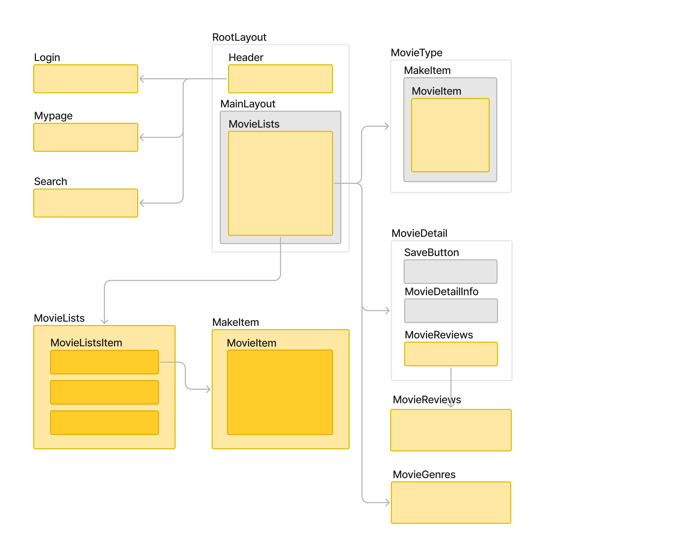

# TMDB API를 이용한 영화 추천 페이지
React의 숙련도 향상을 위해 진행한 TMDB API 활용 영화 추천 홈페이지

## 프로젝트
- 현재 상영, 인기 있는 타이틀에 따라 순위를 보여주거나 장르에 따른 여러 영화를 추천해주는 페이지입니다.
- 영화 디테일 페이지로 이동 시 영화의 제목과 별점, 장르 및 오버뷰, 리뷰를 확인할 수 있습니다.

### 기능
- 회원 가입
  - 비회원 이용자의 회원 전환률 고려해 회원 가입 유도하는 직관적 버튼 배치 및 시각적 강조
- 로그인 / 로그아웃
  - 특정 아이디 및 비밀번로 저장 및 검증 기능 구현
  - LocalStorage 전역 상태를 활용한 로그인 정보 저장 및 유지 기능 구현
- 영화 저장 / 삭제
  - 영화 정보 저장을 LocalStorage 전역 상태를 활용해 유지 기능 구현 
  - 로그아웃 상태에서 접근 시 로그인 및 회원가입 유도를 통한 사용자 편의성 고려, 접근성 향상

### 개발 환경
* axios 1.7
* react 18.3
* react-redux 9.1
* vite 5.4

 

## Wireframe
  
